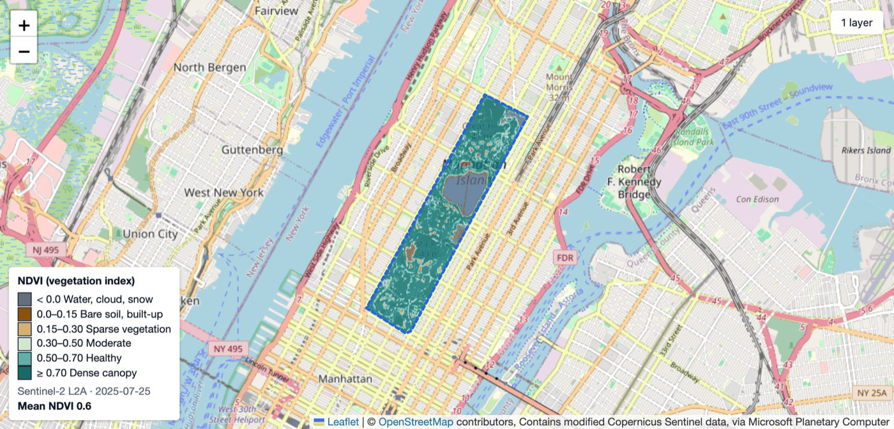

# GeoAgent

Ask for **"Buildings and roads around Central Park"** or **"NDVI of Central Park, July 2025"** and get
GeoJSON or a GeoTIFF, shown on a map and ready to download.

The LLM only chooses tools; it never produces coordinates.



Getting this data by hand means geocoding the place, writing an Overpass query, searching a
satellite catalogue, filtering by cloud cover, computing NDVI and exporting files. GeoAgent does
those steps for you. It runs locally for one person, with a SQLite database.

**Stack:** Python 3.12, FastAPI, pydantic-ai-slim over OpenRouter, GeoPandas, OSMnx, Shapely,
pystac-client with odc-stac and rioxarray (Sentinel-2 from Microsoft Planetary Computer),
SQLAlchemy on SQLite, vanilla JS with Leaflet.

## Why it is safe

The model can call three tools, and their argument types are the trust boundary:

| Tool | Arguments |
|---|---|
| `resolve_area` | `place`: a string, at most 200 characters |
| `extract_vector` | `layers`: 1–7 names from `boundary, buildings, roads, waterways, landuse, amenities, natural` |
| `fetch_imagery` | `start_date`, `end_date`: dates (at most 366 days apart); `max_cloud_cover`: 0–100 |

No tool takes a coordinate, a bounding box, a geometry or a file path. Python geocodes the place
(Nominatim), keeps the area of interest in the database, and does every query, reprojection and
NDVI calculation itself. The prompt holds only the area's name, source and size, not its coordinates.
A test (`tests/test_agent_loop.py`) checks the tool schemas and fails if a parameter named like
`bbox`, `coords`, `geometry` or `path`, or a list of numbers, ever appears.

**Residual risk:** the model can still pick the wrong *place* (there are many Springfields). So
the resolved name and area are echoed back in the progress list, the "Area" bar and the map
outline, where a wrong place is easy to spot.

## How a request runs

```
POST /api/sessions/{id}/messages  ->  task row (queued)  ->  202 + events URL
          run_task: queued -> running -> succeeded | failed
          browser:  GET /api/tasks/{id}/events  (Server-Sent Events)
```

- **State machine.** Each chat message becomes a task: `queued -> running -> succeeded` or
  `failed`. Every status change is a compare-and-set (`UPDATE ... WHERE status = ?`), and the
  final status, the last event and the assistant reply are written in one transaction. On
  startup, tasks left `queued` or `running` by a previous process are marked failed.
- **Events and SSE.** Progress events have a gapless per-task `seq`. The stream sends `id: <seq>`,
  so a reconnecting browser resumes with `Last-Event-ID` (or `?after_seq=`) and misses nothing.
  The stream holds no database connection: each poll opens and closes a short session, so many
  open tabs can't use up the connection pool. A stream stops after `TASK_TIMEOUT_S + 30` seconds.
- **Limits.** Each run has a hard deadline (`TASK_TIMEOUT_S`) and usage limits (6 model requests,
  8 tool calls, 40k tokens). Tools run one at a time. One active task per session (a second
  message gets 409, enforced by a partial unique index), and at most 2 tasks run at once.
- **Errors.** Timeouts, the daily free-tier limit, connection problems, usage limits and a
  missing key each get a plain reply. Anything else shows "Something went wrong (ref: <task id>)"
  and the details go to the server log only, never to the chat or the database.

## Layers and limits

- **Vector layers** come from OpenStreetMap via OSMnx and are saved as GeoJSON (EPSG:4326).
  `boundary` is the geocoded outline itself. Other layers need an area of at most
  `VECTOR_MAX_AREA_KM2` (750 km²), and a layer with more than 200,000 features is refused.
- **NDVI** uses the clearest Sentinel-2 L2A day in the date range, at 10, 20 or 60 m so the area
  fits in `RASTER_MAX_PIXELS` (25 million). You get a float32 GeoTIFF (nodata -9999) to download
  and a small colour PNG preview (EPSG:4326) for the map, with a 6-class legend and the mean NDVI.

## Configuration

`scripts/start.sh` copies `.env.example` to `.env` the first time.

| Variable | Default | What it does |
|---|---|---|
| `OPENROUTER_API_KEY` | empty | OpenRouter key. Without it every message fails with a short reply. |
| `LLM_BASE_URL` | `https://openrouter.ai/api/v1` | OpenAI-compatible endpoint |
| `MODEL` | `nvidia/nemotron-3-super-120b-a12b:free` | Model ID on OpenRouter |
| `DATA_DIR` | `./data` | SQLite database, task outputs and the OSM cache |
| `NOMINATIM_USER_AGENT` | `geoagent/1.0 (+https://github.com/Krish3101/geoagent)` | User agent for Nominatim and Overpass |
| `OVERPASS_URL` | empty (OSMnx default, `overpass-api.de`) | Overpass mirror to use if the main server is down |
| `VECTOR_MAX_AREA_KM2` | `750` | Largest area for layers other than `boundary` |
| `RASTER_MAX_PIXELS` | `25000000` | Largest NDVI raster; the resolution steps down to fit |
| `TASK_TIMEOUT_S` | `300` | Deadline for one task, in seconds |
| `LOG_LEVEL` | `INFO` | Server log level |
| `PORT` | `8000` | Port for `start.sh` (shell variable, not in `.env`) |

## Run

```bash
./scripts/start.sh               # or: PORT=8102 ./scripts/start.sh
```

It needs [uv](https://docs.astral.sh/uv/). It installs the locked dependencies and serves on
`http://127.0.0.1:8000` as a single process (the task queue lives in that process, so don't run
several workers). Put your key in `.env`; the default model is on OpenRouter's free tier.

To reset everything, stop the server and `rm -rf data`. The server also refuses to start on a
database from an older version and tells you to do this.

## Tests

```bash
uv run pytest -q                 # 54 offline tests
uv run pytest -m network         # 3 tests against Nominatim, Overpass and Planetary Computer
uv run ruff check . && uv run ruff format --check .
```

The offline tests use no network and no key. The agent-loop tests drive the real `run_task` with
pydantic-ai's `FunctionModel`: parallel tool calls stay ordered with gapless events, a slow tool
hits the deadline and frees its slot, a looping model stops at the usage limit, a bad date range
goes back to the model as a retry, and a database error never reaches the chat. Other tests cover
the state machine, 16 open SSE streams not blocking the API, 8 concurrent posts giving one 202
and seven 409s, geocoding, vector and NDVI helpers, and the download path check.

## Limitations

- Local only, one user, no login. It binds to `127.0.0.1`.
- Free OpenRouter models may log prompts, so don't type anything private.
- After a reload, the Files panel and the map show only the latest task's files.
- `data/runs` keeps every output file until you delete it.
- A timed-out task is marked failed at once, but an OSM or STAC download already running in a
  worker thread can't be stopped; it finishes in the background and its file is never listed.
- Nominatim is throttled to one request per second, as its usage policy asks.

## License

[MIT](LICENSE)
